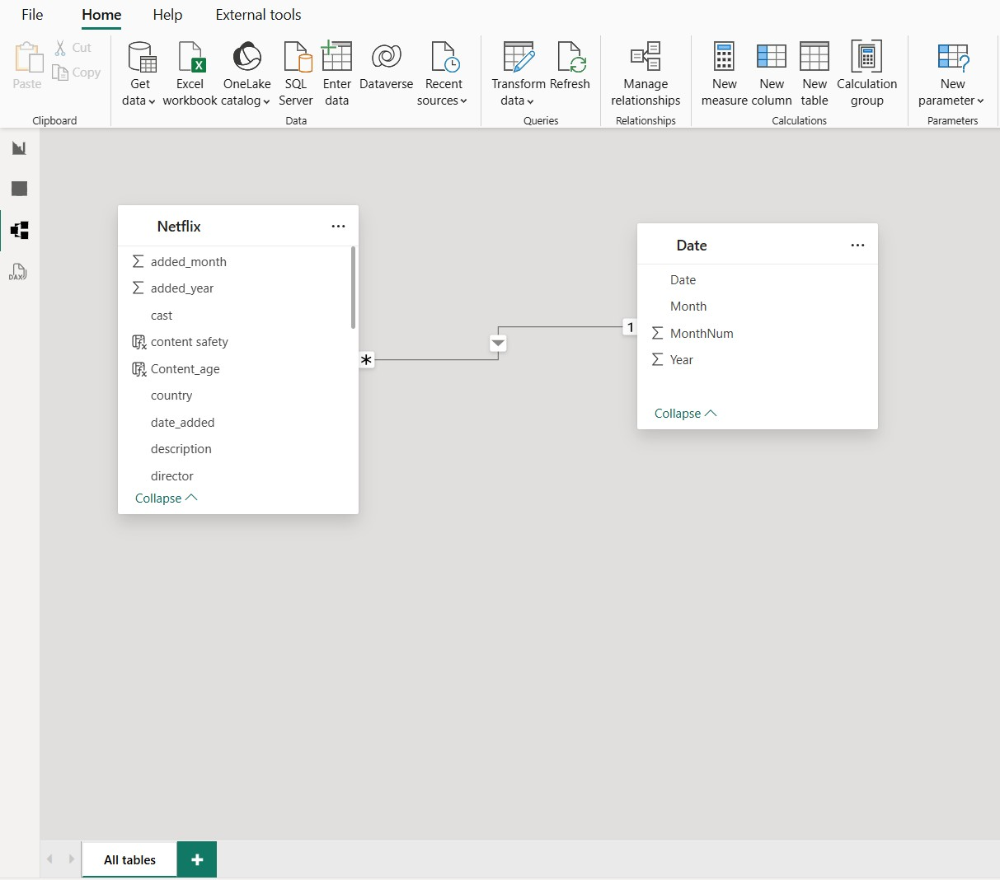

# 🎬 Netflix Content Analysis Dashboard | Power BI

An interactive **Power BI dashboard project** analyzing Netflix Movies & TV Shows data to uncover content growth trends, audience preferences, regional distribution, and business insights.

This project combines **SQL for data cleaning & transformation** with **Power BI for visualization and storytelling** to create a comprehensive multi-page analytics dashboard.

---

# 📊 Dashboard Preview

## 📺 Netflix Dashboard Screenshot

<a href="https://www.linkedin.com/posts/moksh-kapoor-618495322_dataanalytics-dataanalyst-powerbi-ugcPost-7444239716889063424-lHaW?utm_source=share&utm_medium=member_desktop&rcm=ACoAAFGVzjQBQzKnpNzkuOZayyyvYW4FkHnrf28" target="_blank">
  
</a>

---

## 🧩 Data Model

<a href="https://www.linkedin.com/posts/moksh-kapoor-618495322_dataanalytics-dataanalyst-powerbi-ugcPost-7444239716889063424-lHaW?utm_source=share&utm_medium=member_desktop&rcm=ACoAAFGVzjQBQzKnpNzkuOZayyyvYW4FkHnrf28" target="_blank">
  
</a>

---

# 🌐 Live Interactive Dashboard

👉 **View Live Power BI Dashboard:**  

[Click Here to Open Dashboard](https://app.powerbi.com/view?r=eyJrIjoiMzUzNDRkMDItZTJiYi00OTY4LTgxN2EtNGQzMGRmYzYyYzQ2IiwidCI6ImIwNWJjYjBjLWVlYjgtNDMyOC05NDNkLTE1ZmVkYTE3ODBkZiJ9)

---

# 📁 Dataset Overview

This project analyzes the **Netflix Movies & TV Shows dataset** containing **8,790+ titles** across multiple countries and years.

### Dataset Includes:
- Title Name  
- Content Type (Movie / TV Show)  
- Country  
- Release Year  
- Date Added  
- Rating  
- Duration  
- Genre  
- Director & Cast  
- Kid-Friendly Classification  

The data was first cleaned using **SQL** and later visualized in **Power BI** to analyze Netflix’s content strategy, audience focus, and global expansion trends.

---

# 🎯 Business Problem & Analysis

Netflix continuously invests in content creation and acquisition.  
The objective of this project is to understand:

- How Netflix content has grown over time  
- Movies vs TV Show distribution  
- Which countries dominate content production  
- Which genres and ratings are most common  
- Monthly and yearly content growth trends  
- Kid-friendly vs non-kid content distribution  
- Content duration and engagement trends  

The dashboard transforms raw Netflix data into actionable business insights for strategic decision-making.

---

# 📊 Dashboard Pages

## 📌 1. Netflix Content & Overview
- Total titles added over time  
- Movies vs TV Shows split  
- Old vs New content analysis  
- Top producing countries  

## 📈 2. Content Growth & Trends
- Month-over-Month (MoM %) growth  
- Year-over-Year (YoY %) growth  
- Monthly content addition trends  
- Content growth over time  

## ⏱️ 3. Content Depth & Duration
- Average movie duration trends  
- Duration bucket analysis  
- Longest movies & TV shows  
- Season distribution analysis  

## 🌍 4. Geographical Analysis
- Country-wise content distribution  
- Movies vs TV Shows by country  
- Rating analysis by region  
- Global content contribution  

## 🇮🇳 5. India Market Deep Dive
- Indian content growth trends  
- Top Indian actors  
- Rating distribution in India  
- India Movies vs TV Shows analysis  

## 🎭 6. Genre & Creator Analysis
- Top genres globally  
- Top directors  
- Genre popularity trends  
- Content category analysis  

## 👨‍👩‍👧 7. Content Safety & Kids Analysis
- Kid-friendly content percentage  
- Rating distribution by audience type  
- Family-oriented content insights  

---

# 🛠️ Tools, Techniques & Concepts Used

## 🔹 SQL
- Data cleaning & preprocessing  
- Handling null values  
- Standardizing duration fields  
- Date transformations  

## 🔹 Power BI
- Power Query transformations  
- Data Modeling  
- DAX Measures & KPIs  
- Interactive dashboard design  
- Drill-through & slicers  
- Multi-page report storytelling  

## 🔹 DAX Measures
- Total Titles  
- Movies vs TV Shows %  
- Month-over-Month Growth %  
- Year-over-Year Growth %  
- Average Duration Metrics  

---

# 📊 Key Insights & Findings

| Insight | Finding |
|---|---|
| Content Growth | Rapid growth after 2016 |
| Peak Expansion | Highest additions around 2019 |
| Content Mix | Movies dominate (~69.7%) |
| Top Countries | US, India, UK |
| Duration Trend | Most movies are 90–120 mins |
| Monthly Trends | Strong seasonal content spikes |
| India Insights | 92%+ Indian titles are movies |
| Kid-Friendly Content | Nearly 90% classified kid-friendly |

---

# 💡 Business Recommendations

- Increase investment in TV Shows for better long-term engagement  
- Expand regional original content in emerging markets  
- Leverage seasonal release strategies during high-engagement months  
- Focus on optimal movie durations (90–120 mins)  
- Strengthen family & kids content segmentation  

---

# 🔍 Key Learnings

Through this project, I improved my skills in:

- SQL Data Cleaning  
- Power BI Dashboarding  
- Data Modeling  
- DAX Calculations  
- KPI Reporting  
- Business Storytelling  
- Trend & Growth Analysis  
- Interactive Data Visualization  

---

# 📂 Repository Structure

```bash
netflix-content-analysis-powerbi/
│
├── Datasets/
│   ├── netflix_titles.csv
|
├── Images/
│   ├── POWERBI P1.png
│   └── schema.jpg
│
├── README.md
```

---

# 👤 Author

## Moksh Kapoor  
📊 Aspiring Data Analyst  

### Skills
SQL • Power BI • Excel • Python

---

# 🔗 Connect With Me

<a href="https://www.linkedin.com/in/moksh-kapoor-618495322/" target="_blank">
  Visit My LinkedIn Profile
</a>

---

⭐ If you found this project useful, consider giving this repository a star!
